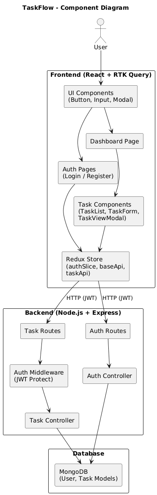

# 🚀 TaskFlow – Scalable Task Management Web Application

TaskFlow is a full-stack web application built using **React (Frontend)** and **Node.js + Express (Backend)** with **MongoDB** as the database.

The application implements secure JWT authentication and provides a responsive dashboard with full CRUD functionality for managing tasks.

---

## ✨ Features

- 🔐 JWT Authentication (Register / Login / Logout)
- 🔒 Protected Routes using middleware
- 📋 Task CRUD (Create, Read, Update, Delete)
- 🔎 Search functionality
- 🔄 Task status toggle (Pending / Completed)
- 📱 Fully responsive UI (Mobile, Tablet, Desktop)
- 🔔 Toast notifications for user feedback
- ⚡ Redux Toolkit + RTK Query for state management
- 🛡 Password hashing using bcrypt
- 🧱 Modular and scalable architecture

---

## 🛠 Tech Stack

### Frontend
- React (Vite)
- Redux Toolkit
- RTK Query
- React Router
- Tailwind CSS
- React Hot Toast

### Backend
- Node.js
- Express.js
- MongoDB
- Mongoose
- JWT Authentication
- bcrypt (Password hashing)

---

# ⚙️ Setup Instructions


---

# 🔹 Backend Setup

### Install Dependencies

```bash
cd backend
npm install
```

### Create .env File

Create a `.env` file inside backend folder:

```
PORT=8000
MONGO_URI=your_mongodb_connection_string
JWT_SECRET=your_secret_key
```

### Run Backend

```bash
npm run dev
```

Backend runs on:

```
http://localhost:8000
```

---

# 🔹 Frontend Setup

### Install Dependencies

```bash
cd frontend
npm install
```

### Install Required Libraries

```bash
npm install @reduxjs/toolkit react-redux react-router-dom react-hot-toast
```

### Install Tailwind CSS

```bash
npm install -D tailwindcss postcss autoprefixer
npx tailwindcss init -p
```

### Configure Tailwind

Update `tailwind.config.js`:

```js
export default {
  content: [
    "./index.html",
    "./src/**/*.{js,ts,jsx,tsx}",
  ],
  theme: {
    extend: {},
  },
  plugins: [],
}
```

Add this to `src/index.css`:

```css
@tailwind base;
@tailwind components;
@tailwind utilities;
```

Add this to postcss.config.js
```
export default {
  plugins: {
    tailwindcss: {},
    autoprefixer: {},
  },
}
```
### Run Frontend

```bash
npm run dev
```

Frontend runs on:

```
http://localhost:5173
```

---

# 🔐 Authentication Flow

1. User registers → Password hashed using bcrypt
2. JWT token generated
3. Token stored and attached in Authorization header
4. Protected routes validated using middleware
5. Logout clears authentication state

---

# 📦 Redux Toolkit Usage

Redux Toolkit is used for centralized state management.

### Why Redux Toolkit?

- Simplifies Redux setup
- Reduces boilerplate code
- Includes best practices by default
- RTK Query simplifies API integration

### How It Is Implemented

- `authSlice` → manages authentication state
- `baseApi` → handles base API configuration and JWT headers
- `taskApi` → manages CRUD API endpoints
- `store.js` → configures global store

### RTK Query Benefits

- Built-in caching
- Automatic loading and error states
- Efficient data fetching
- Scalable API management

Redux ensures maintainability and scalability as the application grows.

---

# 🔌 API Overview

Base URL:

```
http://localhost:8000/api
```

### Auth Endpoints

- POST /auth/register
- POST /auth/login

### Task Endpoints (Protected)

- GET /tasks
- GET /tasks?search=keyword
- POST /tasks
- PUT /tasks/:id
- DELETE /tasks/:id

Authorization Header:

```
Authorization: Bearer <token>
```

---

# 🛡 Security Implementation

- Password hashing using bcrypt
- JWT authentication
- Protected routes middleware
- Task ownership validation
- Environment variables for sensitive data
- Proper CORS configuration

---

# 🚀 Production Scaling Plan

### Frontend
- Use environment variables for API base URL
- Implement lazy loading & code splitting
- Add token refresh mechanism
- Use HTTP-only cookies in production

### Backend
- Dockerize application
- Use NGINX reverse proxy
- Implement rate limiting
- Add request validation (Joi/Zod)
- Add logging (Winston/Morgan)
- Use Redis for caching

### Database
- Add indexes for searchable fields
- Implement pagination for large datasets
- Use MongoDB Atlas cluster scaling

---

# 📊 Architecture Diagram

Below is the high-level component architecture:



---

# 📬 Deliverables Included

- GitHub Repository (Frontend + Backend)
- Functional Authentication System
- CRUD-enabled Dashboard
- API Documentation
- Postman Collection
- Backend Execution Logs
- Production Scaling Strategy

---

# 👨‍💻 Author

Gujjula Sai Navadeep Reddy 

